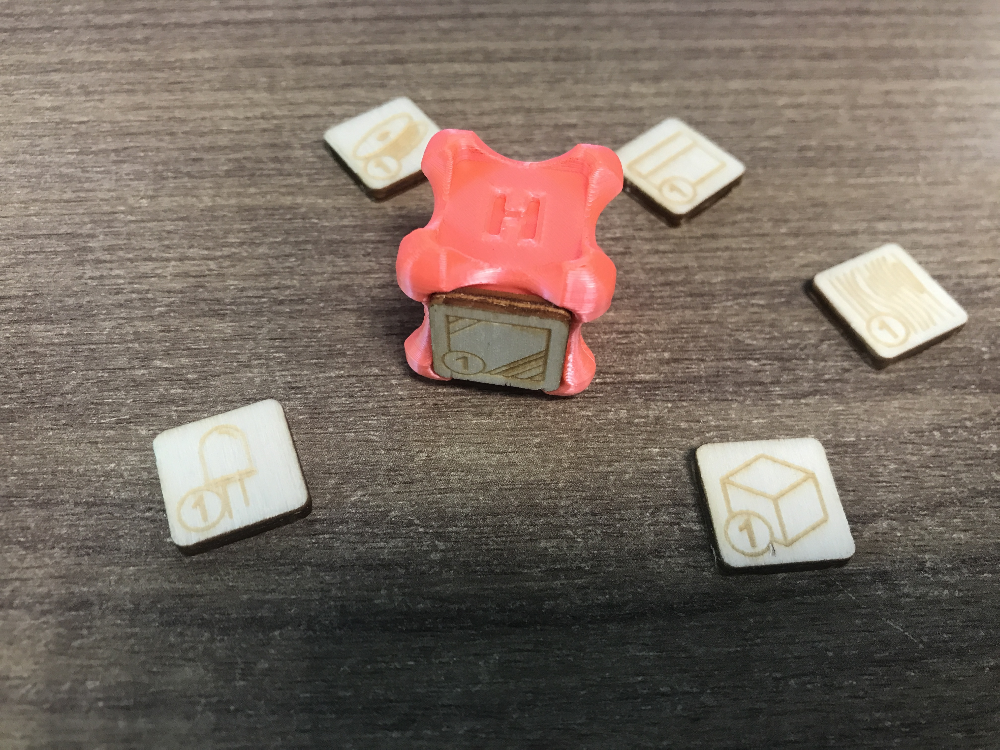

## Contenu

Vous trouverez ici :

- les fichiers 3D permettant l'impression 3D de la base des dés. Il existe une version "FDM" qui est adaptée aux imprimantes à dépot de fil, et une version "SLA" qui est adaptée aux imprimantes résine. Les fichiers sources au format Fusion360 sont également fournis, si vous souhaitez faire des modifications.
- les fichiers .svg de toutes les faces de dés. Il est prêt à l'emploi, pour un jeu complet.

## Fabrication

### La base des dés :

Si vous utilisez une imprimante FDM, **imprimez les dés avec la face marqué d'un H vers le haut**. En effet, cette face, ainsi que la face opposée, ont des dimensions légèrement différentes par rapport aux autres, pour permettre une bonne accroche des faces interchangeables.
Imprimez les dés avec un **taux de remplissage à 100%** pour un équilibrage optimal, et en hauteur de couche 0,15mm ou inférieure.

Si vous utilisez une imprimante résine, prennez le fichier correspondant. Déterminez vos propres réglages, nous n'avons pas testé cette option.

### Les faces de dés :

Elles sont prévues pour être découpées et gravées au laser sur un **matériau de 3mm d'épaisseur**, idéalement du contreplaqué bouleau.
Le fichier de fabrication contient toutes les faces nécessaires pour un jeu complet (contenant 10 dés).
Une fois découpées, les faces doivent être simplement clipsées sur les dés et peuvent ainsi être remplacées par d'autres au fur et à mesure du jeu (se référer aux règles).

**Attention :** Lorsque vous assemblez les faces sur les dés, ne les clipsez pas trop fort, pour pouvoir facilement les enlever si besoin, mais suffisamment tout de même pour qu'elle ne tombent pas quand vous lancez vos dés !

